## 一、前言
> - [bilibili-尚硅谷JDBC实战教程（2023最新版jdbc，JDK17+MySQL8）](https://www.bilibili.com/video/BV1sK411B71e/)
> - [wolai-尚硅谷全新8.x版本JDBC数据库连接技术](https://www.wolai.com/atguigu/dEhsfqP4RazGM2fr2wpSeX)

### 1.1 课程需要哪些前置技术
| 技术           | 版本   | 备注     |
| -------------- | ------ | -------- |
| idea           | 2022.2 | 最新版本 |
| jdk            | 1.8    |          |
| mysql-jdbc驱动 | 8.0.27 | 8.0.25+  |
| druid          | 1.1.21 |          |
| mysql          | 8.0.25 |          |

前置技术
- 需要软件
  - mysql软件安装(8+版本)
  - mysql可视化工具安装
  - idea工具安装(推荐2022版本)
- SQL语句
  - 掌握数据库连接命令
  - 掌握基本的DDL,DQL,DML等命令
  - 掌握数据库事务概念
- Java基础语法
  - 多态机制
  - 基本容器使用(集合和数组等)
  - 泛型
  - 反射等技术

### 1.2 课程学习路线设计
> **学  悟  行**

课程学习路径图
- 阶段一：JDBC版本和概念理解
  - 标题1：全新JDBC课程前言
  - 标题2：全新JDBC技术概述
- 阶段二：JDBC技术核心使用学习
  - 标题3：全新JDBC技术核心API
  - 标题4：全新JDBC扩展拔高
- 阶段三：JDBC连接性能优化连接池使用
  - 标题5：国货之光Druid连接池技术使用
- 阶段四：JDBC使用极致优化工具类高阶封装
  - 标题6：全新JDBC使用优化以及工具类封装
- 阶段五：实践出真知，CMS项目实战
  - 标题7：基于CMS项目JDBC实战练习


## 二、全新JDBC技术概述

### 2.1 jdbc技术概念和理解

#### jdbc技术理解
[ppt展示](./01_%E5%85%A8%E6%96%B0JDBC%E6%8A%80%E6%9C%AF%E6%A6%82%E5%BF%B5%E4%BB%8B%E7%BB%8D.pptx)

#### jdbc概念总结
1. jdbc是(Java Database Connectivity)单词的缩写，翻译为java连接数据库
2. jdbc是java程序连接数据库的 **技术统称**
3. jdbc由 **java语言的规范(接口)** 和 **各个数据库厂商的实现驱动(jar)组成**
4. **jdbc是一种典型的面向接口编程**
5. jdbc优势
   1. 只需要学习jdbc规范接口的方法，即可操作 **所有的数据库软件**
   2. 项目中期切换数据库软件，只需要更换对应的数据库驱动jar包，不需要更改代码

### 2.2 jdbc核心api和使用路线

#### jdbc技术组成
1. jdk下jdbc规范接口，存储在java.sql和javax.sql包中的api
   > 为了项目代码的可移植性，可维护性，SUN公司从最初就制定了Java程序连接各种数据库的统一 **接口规范** 。这样的话，不管是连接哪一种DBMS软件，Java代码可以保持一致性。
2. 各个数据库厂商提供的驱动jar包
   > 因为各个数据库厂商的DBMS软件各有不同，那么内部如何通过sql实现增、删、改、查等管理数据，只有这个数据库厂商自己更清楚，因此把接口规范的实现交给各个数据库厂商自己实现。

   jar包是什么?

   > java程序打成的一种压缩包格式，你可以将这些jar包引入你的项目中，然后你可以使用这个java程序中类和方法以及属性了!

#### 涉及具体核心类和接口

##### DriverManager
1. 将第三方数据库厂商的实现驱动jar注册到程序中
2. 可以根据数据库连接信息获取connection

##### Connection
- 和数据库建立的连接，在连接对象上，可以多次执行数据库curd动作
- 可以获取statement和preparedstatement, callablestatement对象

##### Statement | PreparedStatement | CallableStatement
- 具体发送SQL语句到数据库管理软件的对象
- 不同发送方式稍有不同! **preparedstatement** 使用为重点!

##### Result
- **面向对象思维的产物** (抽象成数据库的查询结果表)
- 存储DQL查询数据库结果的对象
- 需要我们进行解析，获取具体的数据库数据

#### jdbc api使用路线
JDBC API使用路线
- 静态SQL路线(没有动态值语句)
  - DriverManager
    - Connection
      - Statement
        - Result
- 预编译SQL路线(有动态值语句)
  - DriverManager
    - Connection
      - PreparedStatement
        - Result
- 执行标准存储过SQL路线
  - DriverManager
    - Collection
      - CallableStatement
        - Result

### 2.3 为什么选择全新 8+版本mysql-jdbc驱动?
[MySQL :: MySQL Connector/J 8.0 Developer Guide :: 3 What's New in Connector/J 8.0?](https://dev.mysql.com/doc/connector-j/8.0/en/connector-j-whats-new.html)

#### 支持8.0+版本mysql数据管理软件

##### mysql软件知名版本迭代时间
| 版本号       | 迭代时间     | 大小   |
| ------------ | ------------ | ------ |
| mysql-8.0.25 | 4月 30, 2021 | 435.7M |
| mysql-5.7.25 | 1月 10, 2019 | 387.7M |
| mysql-5.5.30 | 9月 19, 2012 | 201.5M |

##### mysql 8.x版本数据库性能提升介绍
**性能提升级。** 官方表示MySQL 8.0 的速度要比 MySQL 5.7 快 2 倍。

MySQL 8.0 在读/写工作负载、IO 密集型工作负载、以及高竞争工作负载时相比MySQL5.7有更好的性能。

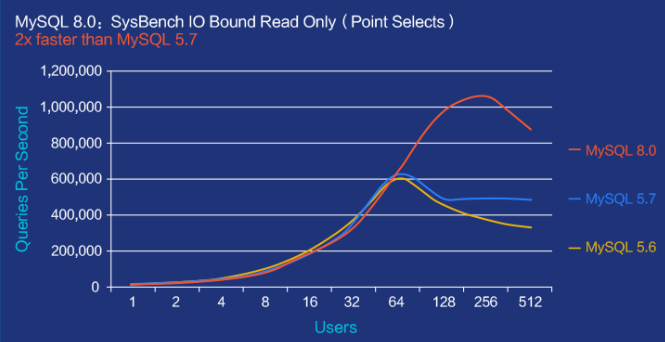

#### 支持java jdbc规范 4.2+版本新特性

##### java jdbc规范驱动版本和更新时间
| Year | JDBC Version | JSR Specification | JDK Implementation |
| ---- | ------------ | ----------------- | ------------------ |
| 2017 | JDBC 4.3     | JSR 221           | Java SE 9          |
| 2014 | JDBC 4.2     | JSR 221           | **Java SE 8**      |
| 2011 | JDBC 4.1     | JSR 221           | Java SE 7          |
| 2006 | JDBC 4.0     | JSR 221           | Java SE 6          |
| 2001 | JDBC 3.0     | JSR 54            | JDK 1.4            |
| 1999 | JDBC 2.1     |                   | JDK 1.2            |
| 1997 | JDBC 1.2     |                   | JDK 1.1            |

##### jdbc规范版本更新内容(了解)
**JDBC 4.3 中引入的主要新功能包括：**
- 添加了对分片的支持
- 添加了 java.sql.连接生成器接口
- 添加了 java.sql.ShardigKey 接口
- 添加了 java.sql.分片密钥生成器接口
- 添加了 .sql.XA 连接生成器接口
- 添加了 javax.sql.池连接生成器接口

**JDBC 4.2 中引入的主要新功能包括：**
- 添加了对引用光标的支持
- 添加了 java.sql.驱动程序操作接口
- 添加了.sql.SQLType 接口
- 添加 java.sql.JDBCType 枚举
- 一些 JDBC 接口更改

**JDBC 4.1 中引入的主要新功能包括：**
- 添加了对“使用资源试用”语句的支持
- 增强的日期值和时间戳值
- 从 Java 对象到 JDBC 类型的其他映射
- 一些 JDBC 接口更改

**JDBC 4.0 中引入的主要新功能包括：**
- 自动加载爪哇.sql.驱动程序
- 数据类型支持
- 国家字符集转换支持
- 支持

> 由于 JDBC 4.3 API 是向后兼容的，因此将 Java SE 9 或更高版本与 JDBC 4.2、4.1、4.0 或 3.0 驱动程序一起使用没有问题，只要您不使用 JDBC 4.3 API 中引入的新方法或类。

#### 支持 jdk1.8版本语法变更新特性
Connector/J 8.0是专门为在Java 8平台上运行而创建的。

众所周知，Java8与早期的Java版本高度兼容，

但还是存在少量不兼容性，所以，驱动技术版本，尽量选择支持jdk 8.0+!

#### 支持全新的驱动api，增加自动时区选择和默认utf-8编码格式等配置


## 三、全新JDBC核心API

### 3.1 引入mysql-jdbc驱动jar

#### 1. 驱动jar版本选择
我们选择版本 8.0.27版本

| mysql版本   | 推荐驱动版本 | 备注                                              |
| ----------- | ------------ | ------------------------------------------------- |
| mysql 5.5.x | 5.0.x        | com.mysql.jdbc.Driver                             |
| mysql 5.7.x | 5.1.x        | com.mysql.jdbc.Driver                             |
| msyql 8.x   | 8.0.x        | 建议: 8.0.25+省略时区设置com.mysql.cj.jdbc.Driver |

#### 2. java工程导入依赖
1. **项目创建lib文件夹**
2. **导入驱动依赖jar包**
3. **jar包右键-添加为项目依赖**
   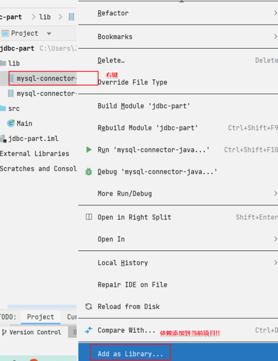

### 3.2 jdbc基本使用步骤分析（6步）
1. 注册驱动
2. 获取连接
3. 创建发送sql语句对象
4. 发送sql语句，并获取返回结果
5. 结果集解析
6. 资源关闭

### 3.3 基于statement演示查询

#### 准备数据库数据
```sql
CREATE DATABASE atguigu;

USE atguigu;

CREATE TABLE t_user(
   id INT PRIMARY KEY AUTO_INCREMENT COMMENT '用户主键',
   account VARCHAR(20) NOT NULL UNIQUE COMMENT '账号',
   password VARCHAR(64) NOT NULL COMMENT '密码',
   nickname VARCHAR(20) NOT NULL COMMENT '昵称');

INSERT INTO t_user(account,password,nickname) VALUES
  ('root','123456','经理'),('admin','666666','管理员');
```

#### 查询目标
查询全部用户信息，进行控制台输出


#### 基于statement实现查询 **(演示步骤)**
```java
/**
 * @Author 赵伟风
 * Description: 利用jdbc技术,完成用户数据查询工作
 *
 * TODO: 步骤总结 (6步)
 *    1. 注册驱动
 *    2. 获取连接
 *    3. 创建statement
 *    4. 发送SQL语句,并获取结果
 *    5. 结果集解析
 *    6. 关闭资源
 */
public class JdbcBasePart {

    public static void main(String[] args) throws SQLException {

        //1.注册驱动
        /**
         * TODO: 注意
         *   Driver -> com.mysql.cj.jdbc.Driver
         */
        DriverManager.registerDriver(new Driver());

        //2.获取连接
        /**
         * TODO: 注意
         *   面向接口编程
         *   java.sql 接口 = 实现类
         *   connection 使用java.sql.Connection接口接收
         */
        Connection connection = DriverManager.getConnection("jdbc:mysql://localhost:3306/atguigu",
                "root",
                "root");

        //3.创建小车
        Statement statement = connection.createStatement();

        //4.发送SQL语句
        String sql = "select id,account,password,nickname from t_user ;";
        ResultSet resultSet =  statement.executeQuery(sql);

        //5.结果集解析
        while (resultSet.next()){
            int id = resultSet.getInt("id");
            String account = resultSet.getString("account");
            String password = resultSet.getString("password");
            String nickname = resultSet.getString("nickname");
            System.out.println(id+"::"+account+"::"+password+"::"+nickname);
        }

        //6.关闭资源  【先开后关】
        resultSet.close();
        statement.close();
        connection.close();

    }

}
```

### 3.4 基于statement方式问题

#### 本案例目标
- 明确jdbc流程和详细讲解使用( **注册驱动** ， **获取连接** ， **发送语句** ， **结果解析** )
- 发现问题，引出preparedstatement

#### 准备数据库数据
> 上个案例相同的数据库

```sql
CREATE DATABASE atguigu;

USE atguigu;

CREATE TABLE t_user(
   id INT PRIMARY KEY AUTO_INCREMENT COMMENT '用户主键',
   account VARCHAR(20) NOT NULL UNIQUE COMMENT '账号',
   PASSWORD VARCHAR(64) NOT NULL COMMENT '密码',
   nickname VARCHAR(20) NOT NULL COMMENT '昵称');

INSERT INTO t_user(account,PASSWORD,nickname) VALUES
  ('root','123456','经理'),('admin','666666','管理员');
```

#### 演示目标
模拟登录，控制台输入账号和密码，判断是否登陆成功成功!


#### 基于statement实现模拟登录
```java
/**
 * @Author 赵伟风
 * Description: 输入账号密码,模拟用户登录!
 */
public class JdbcStatementLoginPart {

    public static void main(String[] args) throws ClassNotFoundException, SQLException {

        //1.输入账号和密码
        Scanner scanner = new Scanner(System.in);
        String account = scanner.nextLine();
        String password = scanner.nextLine();
        scanner.close();

        //2.jdbc的查询使用
        /**
         * 类加载： java文件 -> 编译 -> 【 class字节码文件 -->  类加载 --> jvm虚拟中  --> Class对象】
         * 类加载具体步骤：  加载 【class文件转成对象加载到虚拟机中】->
         *                连接 【验证（检查类文件） -> 准备 (静态变量赋默认值) -> 解析 (调用静态代码块) 】 ->
         *                初始化 -> (赋真实值)
         * 以下7种方式会触发类加载：
         *    1. new关键字
         *    2. 调用静态属性
         *    3. 调用静态方法
         *    4. 接口 包含1.8 新特性 default关键字
         *    5. 反射 【Class.forName() 类名.class】
         *    6. 子类调用会触发父类的静态代码块
         *    7. 触发类的入口方法main
         */
        //注册一次驱动
        Class.forName("com.mysql.cj.jdbc.Driver");


        /**
         * 重写： 为了子类扩展父类的方法！父类也间接的规范了子类方法的参数和返回！
         * 重载： 重载一般应用在第三方的工具类上，为了方便用户多种方式传递参数形式！简化形式！
         */
        /**
         * 三个参数：
         *    String URL: 连接数据库地址
         *    String user: 连接数据库用户名
         *    String password: 连接数据库用户对应的密码
         * 数据库URL语法：
         *    JDBC:
         *        ip port
         *        jdbc:mysql | jdbc:oracle :// 127.0.0.1 | localhost : 3306 / 数据库名
         *        jdbc:mysql://localhost:3306/day01
         *        192.168.33.45
         *        jdbc:mysql://192.168.33.45/3306/day01
         *        当前电脑的省略写法！ 注意：本机和端口3306
         *        jdbc:mysql://localhost:3306/day01 = jdbc:mysql:///day01
         *
         * 两个参数：
         *     String URL : 写法还是jdbc的路径写法！
         *     Properties : 就是一个参数封装容器！至少要包含 user / password key!存储连接账号信息！
         *
         * 一个参数：
         *    String URL: URl可以携带目标地址，可以通过?分割，在后面key=value&key=value形式传递参数
         *                jdbc:mysql:///day01?user=root&password=123456
         * 扩展路径参数(了解):
         *    serverTimezone=Asia/Shanghai&useUnicode=true&characterEncoding=utf8&useSSL=true
         *
         */
        //获取连接
        Connection connection = DriverManager.getConnection("jdbc:mysql:///atguigu", "root", "root");

        //固定方法固定剂
        //创建statement
        Statement statement = connection.createStatement();

        //执行SQL语句 [动态SQL语句,需要字符串拼接]
        String sql = "select * from t_user where account = '"+account+"' and password = '"+password+"' ;";


        /**
         *  ResultSet 结果集对象 = executeQuery(DQL语句)
         *  int       响应行数  = executeUpdate(非DQL语句)
         */
        ResultSet resultSet = statement.executeQuery(sql);


        //ResultSet == 小海豚  你必须有面向对象的思维：Java是面向对象编程的语言 OOP！
        /**
         *
         * TODO:1.需要理解ResultSet的数据结构和小海豚查询出来的是一样，需要在脑子里构建结果表！
         * TODO:2.有一个光标指向的操作数据行，默认指向第一行的上边！我们需要移动光标，指向行，在获取列即可！
         *        boolean = next()
         *              false: 没有数据，也不移动了！
         *              true:  有更多行，并且移动到下一行！
         *       推荐：推荐使用if 或者 while循环，嵌套next方法，循环和判断体内获取数据！
         *       if(next()){获取列的数据！} ||  while(next()){获取列的数据！}
         *
         *TODO：3.获取当前行列的数据！
         *         get类型(int columnIndex | String columnLabel)
         *        列名获取  //lable 如果没有别名，等于列名， 有别名label就是别名，他就是查询结果的标识！
         *        列的角标  //从左到右 从1开始！ 数据库全是从1开始！
         */

        //进行结果集对象解析
        if (resultSet.next()){
            //只要向下移动，就是有数据 就是登录成功！
            System.out.println("登录成功！");
        }else{
            System.out.println("登录失败！");
        }

        //关闭资源
        resultSet.close();
        statement.close();
        connection.close();
    }

}
```

#### 存在问题
1. SQL语句需要字符串拼接，比较麻烦
2. 只能拼接字符串类型，其他的数据库类型无法处理
3. **可能发生注入攻击**
   > 动态值充当了SQL语句结构，影响了原有的查询结果!

### 3.5 基于preparedStatement方式优化
> 利用 **preparedStatement** 解决上述案 **例注入攻击** 和 **SQL语句拼接问题** ! (重点掌握)

```java
/**
 * @Author 赵伟风
 * Description: 使用预编译Statement解决注入攻击问题
 */
public class JdbcPreparedStatementLoginPart {


    public static void main(String[] args) throws ClassNotFoundException, SQLException {

        //1.输入账号和密码
        Scanner scanner = new Scanner(System.in);
        String account = scanner.nextLine();
        String password = scanner.nextLine();
        scanner.close();

        //2.jdbc的查询使用
        //注册驱动
        Class.forName("com.mysql.cj.jdbc.Driver");

        //获取连接
        Connection connection = DriverManager.getConnection("jdbc:mysql:///atguigu", "root", "root");

        //创建preparedStatement
        //connection.createStatement();
        //TODO 需要传入SQL语句结构
        //TODO 要的是SQL语句结构，动态值的部分使用 ? ,  占位符！
        //TODO ?  不能加 '?'  ? 只能替代值，不能替代关键字和容器名
        String sql = "select * from t_user where account = ? and password = ? ;";
        PreparedStatement preparedStatement = connection.prepareStatement(sql);

        //占位符赋值
        //给占位符赋值！ 从左到右，从1开始！
        /**
         *  int 占位符的下角标
         *  object 占位符的值
         */
        preparedStatement.setObject(2,password);
        preparedStatement.setObject(1,account);

        //这哥们内部完成SQL语句拼接！
        //执行SQL语句即可
        ResultSet resultSet = preparedStatement.executeQuery();
        //preparedStatement.executeUpdate()

        //进行结果集对象解析
        if (resultSet.next()){
            //只要向下移动，就是有数据 就是登录成功！
            System.out.println("登录成功！");
        }else{
            System.out.println("登录失败！");
        }

        //关闭资源
        resultSet.close();
        preparedStatement.close();
        connection.close();
    }

}

```

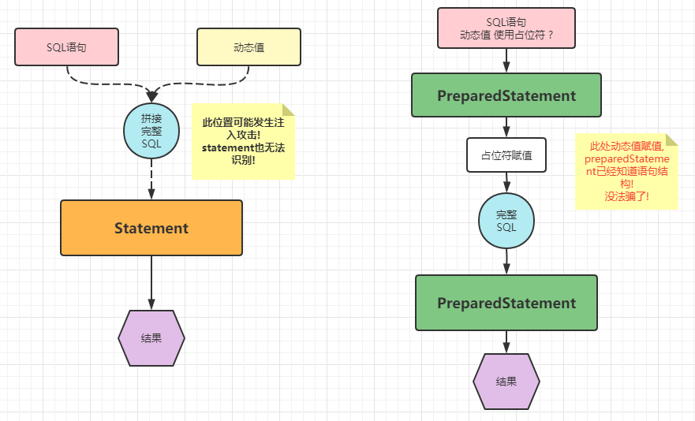

### 3.6 基于preparedStatement演示curd

#### 数据库数据插入
```java
/**
 * 插入一条用户数据!
 * 账号: test
 * 密码: test
 * 昵称: 测试
 */
@Test
public void testInsert() throws Exception{

    //注册驱动
    Class.forName("com.mysql.cj.jdbc.Driver");

    //获取连接
    Connection connection = DriverManager.getConnection("jdbc:mysql:///atguigu", "root", "root");

    //TODO: 切记, ? 只能代替 值!!!!!  不能代替关键字 特殊符号 容器名
    String sql = "insert into t_user(account,password,nickname) values (?,?,?);";
    PreparedStatement preparedStatement = connection.prepareStatement(sql);

    //占位符赋值
    preparedStatement.setString(1, "test");
    preparedStatement.setString(2, "test");
    preparedStatement.setString(3, "测试");

    //发送SQL语句
    int rows = preparedStatement.executeUpdate();

    //输出结果
    System.out.println(rows);

    //关闭资源close
    preparedStatement.close();
    connection.close();
}
```

#### 数据库数据修改
```java
/**
 * 修改一条用户数据!
 * 修改账号: test的用户,将nickname改为tomcat
 */
@Test
public void testUpdate() throws Exception{

    //注册驱动
    Class.forName("com.mysql.cj.jdbc.Driver");

    //获取连接
    Connection connection = DriverManager.getConnection("jdbc:mysql:///atguigu", "root", "root");

    //TODO: 切记, ? 只能代替 值!!!!!  不能代替关键字 特殊符号 容器名
    String sql = "update t_user set nickname = ? where account = ? ;";
    PreparedStatement preparedStatement = connection.prepareStatement(sql);

    //占位符赋值
    preparedStatement.setString(1, "tomcat");
    preparedStatement.setString(2, "test");

    //发送SQL语句
    int rows = preparedStatement.executeUpdate();

    //输出结果
    System.out.println(rows);

    //关闭资源close
    preparedStatement.close();
    connection.close();
}
```

#### 数据库数据删除
```java
/**
 * 删除一条用户数据!
 * 根据账号: test
 */
@Test
public void testDelete() throws Exception{

    //注册驱动
    Class.forName("com.mysql.cj.jdbc.Driver");

    //获取连接
    Connection connection = DriverManager.getConnection("jdbc:mysql:///atguigu", "root", "root");

    //TODO: 切记, ? 只能代替 值!!!!!  不能代替关键字 特殊符号 容器名
    String sql = "delete from t_user where account = ? ;";
    PreparedStatement preparedStatement = connection.prepareStatement(sql);

    //占位符赋值
    preparedStatement.setString(1, "test");

    //发送SQL语句
    int rows = preparedStatement.executeUpdate();

    //输出结果
    System.out.println(rows);

    //关闭资源close
    preparedStatement.close();
    connection.close();
}
```

#### 数据库数据查询
```java
/**
 * 查询全部数据!
 *   将数据存到List<Map>中
 *   map -> 对应一行数据
 *      map key -> 数据库列名或者别名
 *      map value -> 数据库列的值
 * TODO: 思路分析
 *    1.先创建一个List<Map>集合
 *    2.遍历resultSet对象的行数据
 *    3.将每一行数据存储到一个map对象中!
 *    4.将对象存到List<Map>中
 *    5.最终返回
 *
 * TODO:
 *    初体验,结果存储!
 *    学习获取结果表头信息(列名和数量等信息)
 */
@Test
public void testQueryMap() throws Exception{

    //注册驱动
    Class.forName("com.mysql.cj.jdbc.Driver");

    //获取连接
    Connection connection = DriverManager.getConnection("jdbc:mysql:///atguigu", "root", "root");

    //TODO: 切记, ? 只能代替 值!!!!!  不能代替关键字 特殊符号 容器名
    String sql = "select id,account,password,nickname from t_user ;";
    PreparedStatement preparedStatement = connection.prepareStatement(sql);

    //占位符赋值 本次没有占位符,省略

    //发送查询语句
    ResultSet resultSet = preparedStatement.executeQuery();

    //创建一个集合
    List<Map> mapList = new ArrayList<>();

    //获取列信息对象
    ResultSetMetaData metaData = resultSet.getMetaData();
    int columnCount = metaData.getColumnCount();
    while (resultSet.next()) {
        Map map = new HashMap();
        for (int i = 1; i <= columnCount; i++) {
            map.put(metaData.getColumnLabel(i), resultSet.getObject(i));
        }
        mapList.add(map);
    }

    System.out.println(mapList);

    //关闭资源close
    preparedStatement.close();
    connection.close();
    resultSet.close();
}
```

### 3.7 preparedStatement使用方式总结

#### 使用步骤总结
```java
//1.注册驱动

//2.获取连接

//3.编写SQL语句

//4.创建preparedstatement并且传入SQL语句结构

//5.占位符赋值

//6.发送SQL语句,并且获取结果

//7.结果集解析

//8.关闭资源
```

#### 使用API总结
```java
//1.注册驱动
// 方案1: 调用静态方法,但是会注册两次
DriverManager.registerDriver(new com.mysql.cj.jdbc.Driver());
// 方案2: 反射触发
Class.forName("com.mysql.cj.jdbc.Driver");

//2.获取连接
Connection connection = DriverManager.getConnection();
// 3 (String url,String user,String password)
// 2 (String url,Properties info(user password))
// 1 (String url?user=账号&password=密码 )

//3.创建statement
//静态
Statement statement = connection.createStatement();
//预编译
PreparedStatement preparedstatement = connection.preparedStatement(sql语句结构);

//4.占位符赋值
preparedstatement.setObject(?的位置 从左到右 从1开始,值)

//5.发送sql语句获取结果
int rows = executeUpdate(); //非DQL
Resultset = executeQuery(); //DQL

//6.查询结果集解析
//移动光标指向行数据 next();  if(next())  while(next())
//获取列的数据即可   get类型(int 列的下角标 从1开始 | int 列的label (别名或者列名))
//获取列的信息   getMetadata(); ResultsetMetaData对象 包含的就是列的信息
                getColumnCount(); | getCloumnLebal(index)

//7.关闭资源
close();
```

## 四、全新JDBC扩展提升

### 4.1 自增长主键回显实现

#### 功能需求
1. **java程序** 获取 **插入** 数据时mysql维护 **自增长** 维护的主键 **id值** ，这就是主键回显
2. 作用：在多表关联插入数据时，一般主表的主键都是自动生成的，所以在插入数据之前无法知道这条数据的主键，但是从表需要在插入数据之前就绑定主表的主键，这是可以使用主键回显技术。

#### 功能实现
> 继续沿用之前的表数据

```java
/**
 * 返回插入的主键！
 * 主键：数据库帮助维护的自增长的整数主键！
 * @throws Exception
 */
@Test
public void  returnPrimaryKey() throws Exception{

    //1.注册驱动
    Class.forName("com.mysql.cj.jdbc.Driver");
    //2.获取连接
    Connection connection = DriverManager.getConnection("jdbc:mysql:///atguigu?user=root&password=root");
    //3.编写SQL语句结构
    String sql = "insert into t_user (account,password,nickname) values (?,?,?);";
    //4.创建预编译的statement，传入SQL语句结构
    /**
     * TODO: 第二个参数填入 1 | Statement.RETURN_GENERATED_KEYS
     *       告诉statement携带回数据库生成的主键！
     */
    PreparedStatement statement = connection.prepareStatement(sql, Statement.RETURN_GENERATED_KEYS);
    //5.占位符赋值
    statement.setObject(1,"towgog");
    statement.setObject(2,"123456");
    statement.setObject(3,"二狗子");
    //6.执行SQL语句 【注意：不需要传入SQL语句】 DML
    int i = statement.executeUpdate();
    //7.结果集解析
    System.out.println("i = " + i);

    //一行一列的数据！里面就装主键值！
      ResultSet resultSet = statement.getGeneratedKeys();
    resultSet.next();
    int anInt = resultSet.getInt(1);
    System.out.println("anInt = " + anInt);


    //8.释放资源
    statement.close();
    connection.close();
}
```

### 4.2 批量数据插入性能提升

#### 功能需求
1. 批量数据插入优化
2. 提升大量数据插入效率

#### 功能实现
```java
/**
 *
 * 批量细节：
 *    1.url?rewriteBatchedStatements=true
 *    2.insert 语句必须使用 values
 *    3.语句后面不能添加分号;
 *    4.语句不能直接执行，每次需要装货  addBatch() 最后 executeBatch();
 *
 * 批量插入优化！
 * @throws Exception
 */
@Test
public void  batchInsertYH() throws Exception{

    //1.注册驱动
    Class.forName("com.mysql.cj.jdbc.Driver");
    //2.获取连接
    Connection connection = DriverManager.getConnection("jdbc:mysql:///atguigu?rewriteBatchedStatements=true",
            "root","root");
    //3.编写SQL语句结构
    String sql = "insert into t_user (account,password,nickname) values (?,?,?)";
    //4.创建预编译的statement，传入SQL语句结构
    /**
     * TODO: 第二个参数填入 1 | Statement.RETURN_GENERATED_KEYS
     *       告诉statement携带回数据库生成的主键！
     */
    long start = System.currentTimeMillis();
    PreparedStatement statement = connection.prepareStatement(sql);
    for (int i = 0; i < 10000; i++) {

        //5.占位符赋值
        statement.setObject(1,"ergouzi"+i);
        statement.setObject(2,"lvdandan");
        statement.setObject(3,"驴蛋蛋"+i);
        //6.装车
        statement.addBatch();
    }

    //发车！ 批量操作！
    statement.executeBatch();

    long end = System.currentTimeMillis();

    System.out.println("消耗时间："+(end - start));


    //7.结果集解析

    //8.释放资源
    connection.close();
}
```

### 4.3 jdbc中数据库事务实现

#### 章节目标
- 使用jdbc代码，添加数据库事务动作!
- 开启事务
- 事务提交 / 事务回滚

#### 事务概念回顾
- 事务概念
  - 数据库事务就是一种SQL语句执行的缓存机制，不会单条执行完毕就更新数据库数据，最终根据缓存内的多条语句执行结果统一判定!
  - 一个事务内所有语句都成功及事务成功，我们可以触发commit提交事务来结束事务，更新数据!
  - 一个事务内任意一条语句失败，及事务失败，我们可以触发rollback回滚结束事务，数据回到事务之前状态!
  - 举个例子:
    - 临近高考，你好吃懒做，偶尔还瞎花钱，父母也只会说'你等着!'，待到高考完毕!
    - 成绩600+，翻篇，庆祝!
    - 成绩200+，翻旧账，男女混合双打!

- 优势：允许我们在失败情况下，数据回归到业务之前的状态!
- 场景：**一个业务** **涉及** **多条修改** **数据库语句!**
  - 例如:
    - 经典的转账案例，转账业务(加钱和减钱)
    - 批量删除(涉及多个删除)
    - 批量添加(涉及多个插入)

- 事务特性
  1. 原子性（Atomicity）原子性是指事务是一个不可分割的工作单位，事务中的操作要么都发生，要么都不发生。
  2. 一致性（Consistency）事务必须使数据库从一个一致性状态变换到另外一个一致性状态。
  3. 隔离性（Isolation）事务的隔离性是指一个事务的执行不能被其他事务干扰，即一个事务内部的操作及使用的数据对并发的其他事务是隔离的，并发执行的各个事务之间不能互相干扰。
  4. 持久性（Durability）持久性是指一个事务一旦被提交，它对数据库中数据的改变就是永久性的，接下来的其他操作和数据库故障不应该对其有任何影响

- 事务类型
  - 自动提交: 每条语句自动存储一个事务中，执行成功自动提交，执行失败自动回滚! (MySQL)
  - 手动提交: 手动开启事务，添加语句，手动提交或者手动回滚即可!

- sql开启事务方式
  - 针对自动提交: 关闭自动提交即可，多条语句添加以后，最终手动提交或者回滚! (推荐)
    ```sql
    SET autocommit = off; --关闭当前连接自动事务提交方式
    -- 只有当前连接有效
    -- 编写SQL语句即可
    SQL
    SQL
    SQL
    -- 手动提交或者回滚 【结束当前的事务】
    COMMIT / ROLLBACK;
    ```
  - 手动开启事务: 开启事务代码，添加SQL语句，事务提交或者事务回滚! (不推荐)

- 呼应jdbc技术
  ```java
  try{
    connection.setAutoCommit(false); //关闭自动提交了

    //注意，只要当前connection对象，进行数据库操作，都不会自动提交事务
    //数据库动作!
    //statement - 单一的数据库动作 c u r d

    connection.commit();
  }catch(Execption e){
    connection.rollback();
  }
  ```

#### 数据库表数据
```sql
-- 继续在atguigu的库中创建银行表
CREATE TABLE t_bank(
   id INT PRIMARY KEY AUTO_INCREMENT COMMENT '账号主键',
   account VARCHAR(20) NOT NULL UNIQUE COMMENT '账号',
   money  INT UNSIGNED COMMENT '金额,不能为负值') ;

INSERT INTO t_bank(account,money) VALUES
  ('ergouzi',1000),('lvdandan',1000);
```

#### 代码结构设计
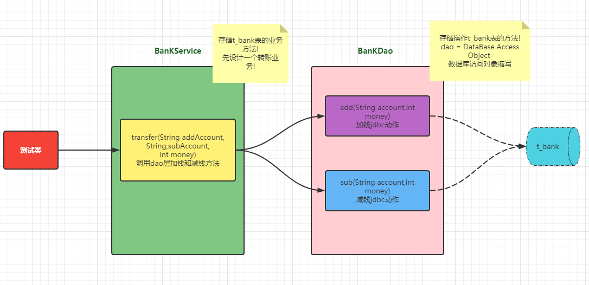

#### jdbc事务实现

##### 测试类
```java
/**
 * @Author 赵伟风
 * Description: 测试类
 */
public class BankTest {

    @Test
    public void testBank() throws Exception {
        BankService bankService = new BankService();
        bankService.transfer("ergouzi", "lvdandan",
                500);
    }

}
```

##### BankService
```java
/**
 * @Author 赵伟风
 * Description: bank表业务类,添加转账业务
 */
public class BankService {


    /**
     * 转账业务方法
     * @param addAccount  加钱账号
     * @param subAccount  减钱账号
     * @param money  金额
     */
    public void transfer(String addAccount,String subAccount, int money) throws ClassNotFoundException, SQLException {

        System.out.println("addAccount = " + addAccount + ", subAccount = " + subAccount + ", money = " + money);

        //注册驱动
        Class.forName("com.mysql.cj.jdbc.Driver");

        //获取连接
        Connection connection = DriverManager.getConnection("jdbc:mysql:///atguigu", "root", "root");

        int flag = 0;

        //利用try代码块,调用dao
        try {
            //开启事务(关闭事务自动提交)
            connection.setAutoCommit(false);

            BankDao bankDao = new BankDao();
            //调用加钱 和 减钱
            bankDao.addMoney(addAccount,money,connection);
            System.out.println("--------------");
            bankDao.subMoney(subAccount,money,connection);
            flag = 1;
            //不报错,提交事务
            connection.commit();
        }catch (Exception e){

            //报错回滚事务
            connection.rollback();
            throw e;
        }finally {
            connection.close();
        }

        if (flag == 1){
            System.out.println("转账成功!");
        }else{
            System.out.println("转账失败!");
        }
    }

}
```

##### BankDao
```java
/**
 * @Author 赵伟风
 * Description: 数据库访问dao类
 */
public class BankDao {

    /**
     * 加钱方法
     * @param account
     * @param money
     * @param connection 业务传递的connection和减钱是同一个! 才可以在一个事务中!
     * @return 影响行数
     */
    public int addMoney(String account, int money,Connection connection) throws ClassNotFoundException, SQLException {


        String sql = "update t_bank set money = money + ? where account = ? ;";
        PreparedStatement preparedStatement = connection.prepareStatement(sql);

        //占位符赋值
        preparedStatement.setObject(1, money);
        preparedStatement.setString(2, account);

        //发送SQL语句
        int rows = preparedStatement.executeUpdate();

        //输出结果
        System.out.println("加钱执行完毕!");

        //关闭资源close
        preparedStatement.close();

        return rows;
    }

    /**
     * 减钱方法
     * @param account
     * @param money
     * @param connection 业务传递的connection和加钱是同一个! 才可以在一个事务中!
     * @return 影响行数
     */
    public int subMoney(String account, int money,Connection connection) throws ClassNotFoundException, SQLException {

        String sql = "update t_bank set money = money - ? where account = ? ;";
        PreparedStatement preparedStatement = connection.prepareStatement(sql);

        //占位符赋值
        preparedStatement.setObject(1, money);
        preparedStatement.setString(2, account);

        //发送SQL语句
        int rows = preparedStatement.executeUpdate();

        //输出结果
        System.out.println("减钱执行完毕!");

        //关闭资源close
        preparedStatement.close();

        return rows;
    }
}
```


## 五、国货之光Druid连接池技术使用

### 5.1 连接性能消耗问题分析
- **贪污和浪费是极大的犯罪** ——毛爷爷
- **connection可以复用!** (年纪轻轻你就范了 浪费连接的罪啊!)

### 5.2 数据库连接池作用

#### 总结缺点:
1. 不使用数据库连接池，每次都通过DriverManager获取新连接，用完直接抛弃断开，连接的利用率太低，太浪费。
2. 对于数据库服务器来说，压力太大了。我们数据库服务器和Java程序对连接数也无法控制，很容易导致数据库服务器崩溃。

#### 我们就希望能管理连接。
- 我们可以建立一个连接池，这个池中可以容纳一定数量的连接对象，一开始，我们可以先替用户先创建好一些连接对象，等用户要拿连接对象时，就直接从池中拿，不用新建了，这样也可以节省时间。然后用户用完后，放回去，别人可以接着用。
- 可以提高连接的使用率。当池中的现有的连接都用完了， **那么连接池可以向服务器申请新的连接放到池中。**
- 直到池中的连接达到“最大连接数”，就不能在申请新的连接了，如果没有拿到连接的用户只能等待。

### 5.3 市面常见连接池产品和对比
JDBC 的数据库连接池使用 `javax.sql.DataSource` 接口进行规范， **所有** 的第三方 **连接池** **都实现此接口** ，自行添加具体实现!
也就是说， **所有连接池获取连接的和回收连接方法都一样** ，不同的只有性能和扩展功能!
- DBCP 是Apache提供的数据库连接池，速度相对c3p0较快，但因自身存在BUG
- C3P0 是一个开源组织提供的一个数据库连接池，速度相对较慢，稳定性还可以
- Proxool 是sourceforge下的一个开源项目数据库连接池，有监控连接池状态的功能，稳定性较c3p0差一点
- Druid 是阿里提供的数据库连接池，据说是集DBCP 、C3P0 、Proxool 优点于一身的数据库连接池，**妥妥国货之光!!!!**
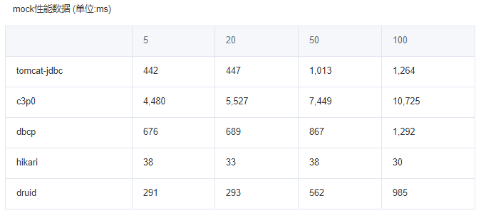
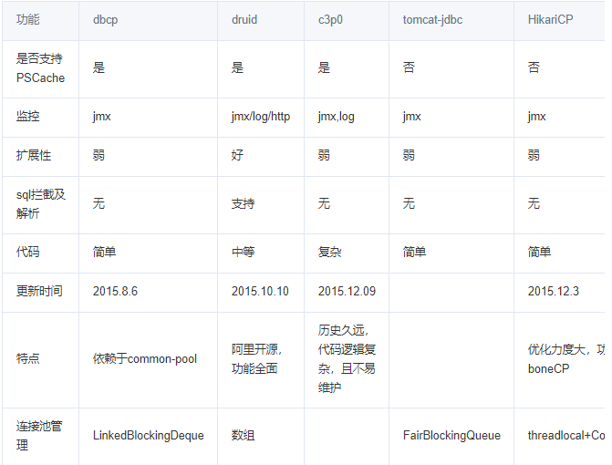

### 5.4 国货之光druid连接池使用
> 记得导入druid工具类jar

#### 硬编码方式(了解，不推荐)
```java
/**
 * 创建druid连接池对象，使用硬编码进行核心参数设置！
 *   必须参数： 账号
 *             密码
 *             url
 *             driverClass
 *   非必须参数：
 *           初始化个数
 *           最大数量等等  不推荐设置
 */
@Test
public void druidHard() throws SQLException {

   DruidDataSource dataSource = new DruidDataSource();

   //设置四个必须参数
   dataSource.setDriverClassName("com.mysql.cj.jdbc.Driver");
   dataSource.setUsername("root");
   dataSource.setPassword("root");
   dataSource.setUrl("jdbc:mysql:///day01");

   //获取连接
   Connection connection = dataSource.getConnection();
   // JDBC的步骤
   //回收连接
   connection.close();
}
```

#### 软编码方式
- 外部配置 存放在 `src/druid.properties`
  ```properties
  # druid连接池需要的配置参数,key固定命名
  driverClassName=com.mysql.cj.jdbc.Driver
  username=root
  password=root
  url=jdbc:mysql:///atguigu
  ```

- druid声明代码
  ```java
  /**
   * 不直接在java代码编写配置文件！
   * 利用工厂模式，传入配置文件对象，创建连接池！
   * @throws Exception
   */
  @Test
  public void druidSoft() throws Exception {
      Properties properties = new Properties();
      InputStream ips = DruidDemo.class.getClassLoader().getResourceAsStream("druid.properties");
      properties.load(ips);
      DataSource dataSource = DruidDataSourceFactory.createDataSource(properties);
  }
  ```

#### druid配置(了解)
| 配置                          | 缺省  | 说明                                                                                                                                                                                                                   |
| ----------------------------- | ----- | ---------------------------------------------------------------------------------------------------------------------------------------------------------------------------------------------------------------------- |
| name                          |       | 配置这个属性的意义在于，如果存在多个数据源，监控的时候可以通过名字来区分开来。 如果没有配置，将会生成一个名字，格式是：”DataSource-” + System.identityHashCode(this)                                                   |
| jdbcUrl                       |       | 连接数据库的url，不同数据库不一样。例如：mysql : jdbc:mysql://10.20.153.104:3306/druid2 oracle : jdbc:oracle:thin:@10.20.149.85:1521:ocnauto                                                                           |
| username                      |       | 连接数据库的用户名                                                                                                                                                                                                     |
| password                      |       | 连接数据库的密码。如果你不希望密码直接写在配置文件中，可以使用ConfigFilter。详细看这里：[使用ConfigFilter](https://github.com/alibaba/druid/wiki/使用ConfigFilter) |
| driverClassName               |       | 根据url自动识别 这一项可配可不配，如果不配置druid会根据url自动识别dbType，然后选择相应的driverClassName(建议配置下)                                                                                                    |
| initialSize                   | 0     | 初始化时建立物理连接的个数。初始化发生在显示调用init方法，或者第一次getConnection时                                                                                                                                    |
| maxActive                     | 8     | 最大连接池数量                                                                                                                                                                                                         |
| maxIdle                       | 8     | 已经不再使用，配置了也没效果                                                                                                                                                                                           |
| minIdle                       |       | 最小连接池数量                                                                                                                                                                                                         |
| maxWait                       |       | 获取连接时最大等待时间，单位毫秒。配置了maxWait之后，缺省启用公平锁，并发效率会有所下降，如果需要可以通过配置useUnfairLock属性为true使用非公平锁。                                                                     |
| poolPreparedStatements        | false | 是否缓存preparedStatement，也就是PSCache。PSCache对支持游标的数据库性能提升巨大，比如说oracle。在mysql下建议关闭。                                                                                                     |
| maxOpenPreparedStatements     | -1    | 要启用PSCache，必须配置大于0，当大于0时，poolPreparedStatements自动触发修改为true。在Druid中，不会存在Oracle下PSCache占用内存过多的问题，可以把这个数值配置大一些，比如说100                                           |
| validationQuery               |       | 用来检测连接是否有效的sql，要求是一个查询语句。如果validationQuery为null，testOnBorrow、testOnReturn、testWhileIdle都不会其作用。                                                                                      |
| testOnBorrow                  | true  | 申请连接时执行validationQuery检测连接是否有效，做了这个配置会降低性能。                                                                                                                                                |
| testOnReturn                  | false | 归还连接时执行validationQuery检测连接是否有效，做了这个配置会降低性能                                                                                                                                                  |
| testWhileIdle                 | false | 建议配置为true，不影响性能，并且保证安全性。申请连接的时候检测，如果空闲时间大于timeBetweenEvictionRunsMillis，执行validationQuery检测连接是否有效。                                                                   |
| timeBetweenEvictionRunsMillis |       | 有两个含义： 1)Destroy线程会检测连接的间隔时间2)testWhileIdle的判断依据，详细看testWhileIdle属性的说明                                                                                                                 |
| numTestsPerEvictionRun        |       | 不再使用，一个DruidDataSource只支持一个EvictionRun                                                                                                                                                                     |
| minEvictableIdleTimeMillis    |       |                                                                                                                                                                                                                        |
| connectionInitSqls            |       | 物理连接初始化的时候执行的sql                                                                                                                                                                                          |
| exceptionSorter               |       | 根据dbType自动识别 当数据库抛出一些不可恢复的异常时，抛弃连接                                                                                                                                                          |
| filters                       |       | 属性类型是字符串，通过别名的方式配置扩展插件，常用的插件有： 监控统计用的filter:stat日志用的filter:log4j防御sql注入的filter:wall                                                                                       |
| proxyFilters                  |       | 类型是List，如果同时配置了filters和proxyFilters，是组合关系，并非替换关系                                                                                                                                              |


## 六、全新JDBC使用优化以及工具类封装

### 6.1 jdbc工具类封装v1.0
> 我们封装一个工具类，内部包含**连接池对象**，同时对外提供连接的方法和回收连接的方法!

#### 外部配置文件
位置: `src/druid.properties`
```properties
# druid连接池需要的配置参数,key固定命名
driverClassName=com.mysql.cj.jdbc.Driver
username=root
password=root
url=jdbc:mysql:///atguigu
```

#### 工具类代码
```java
import com.alibaba.druid.pool.DruidDataSourceFactory;

import javax.sql.DataSource;
import java.sql.Connection;
import java.sql.SQLException;
import java.util.Properties;

public class JDBCToolsVersion1 {
    private static DataSource ds;
    static{//静态代码块，JDBCToolsVersion1类初始化执行
        try {
            Properties pro = new Properties();
            pro.load(ClassLoader.getSystemResourceAsStream("druid.properties"));
            ds = DruidDataSourceFactory.createDataSource(pro);
        } catch (Exception e) {
            e.printStackTrace();
        }
    }

    public static Connection getConnection() throws SQLException {
        return ds.getConnection();//这么写，不能保证同一个线程，两次getConnection()得到的是同一个Connection对象
                            //如果不能保证是同一个连接对象，就无法保证事务的管理
    }

    public static void free(Connection conn) throws SQLException {
        conn.setAutoCommit(true);
        conn.close();//还给连接池
    }
}
```

### 6.2 jdbc工具类封装v.2.0
> 优化工具类v1.0版本,考虑事务的情况下!如何一个线程的不同方法获取同一个连接!

#### ThreadLocal的介绍：
JDK 1.2的版本中就提供java.lang.ThreadLocal，为解决多线程程序的并发问题提供了一种新的思路。
使用这个工具类可以很简洁地编写出优美的多线程程序。通常用来在在多线程中管理共享数据库连接、Session等

ThreadLocal用于保存某个线程共享变量，原因是在Java中，每一个线程对象中都有一个 `ThreadLocalMap<ThreadLocal, Object>`，其key就是一个ThreadLocal，而Object即为该线程的共享变量。而这个map是通过ThreadLocal的set和get方法操作的。对于同一个static ThreadLocal，不同线程只能从中get，set，remove自己的变量，而不会影响其他线程的变量。
1. ThreadLocal对象.get: 获取ThreadLocal中当前线程共享变量的值。
2. ThreadLocal对象.set: 设置ThreadLocal中当前线程共享变量的值。
3. ThreadLocal对象.remove: 移除ThreadLocal中当前线程共享变量的值。

#### v2.0版本工具类
```java
import com.alibaba.druid.pool.DruidDataSourceFactory;

import javax.sql.DataSource;
import java.sql.Connection;
import java.sql.SQLException;
import java.util.Properties;

/*
这个工具类的作用就是用来给所有的SQL操作提供“连接”，和释放连接。
这里使用ThreadLocal的目的是为了让同一个线程，在多个地方getConnection得到的是同一个连接。
这里使用DataSource的目的是为了（1）限制服务器的连接的上限（2）连接的重用性等
 */
public class JDBCTools {
    private static DataSource ds;
    private static ThreadLocal<Connection> tl = new ThreadLocal<>();
    static{//静态代码块，JDBCToolsVersion1类初始化执行
        try {
            Properties pro = new Properties();
            pro.load(ClassLoader.getSystemResourceAsStream("druid.properties"));
            ds = DruidDataSourceFactory.createDataSource(pro);
        } catch (Exception e) {
            e.printStackTrace();
        }
    }

    public static Connection getConnection() throws SQLException {
         Connection connection = tl.get();
         if(connection  == null){//当前线程还没有拿过连接，就给它从数据库连接池拿一个
             connection = ds.getConnection();
             tl.set(connection);
         }
         return connection;
    }

    public static void free() throws SQLException {
        Connection connection = tl.get();
        if(connection != null){
            tl.remove();
            connection.setAutoCommit(true);//避免还给数据库连接池的连接不是自动提交模式（建议）
            connection.close();
        }
    }
}
```

> 注意: **修改转账业务，使用此工具类**

### 6.3 高级应用层封装BaseDao
> 基本上每一个数据表都应该有一个对应的DAO接口及其实现类，发现对所有表的操作（增、删、改、查）代码重复度很高，所以可以**抽取公共代码** ，给这些DAO的实现类可以抽取一个公共的父类，我们称为BaseDao

```java
public abstract class BaseDao {
    /*
    通用的增、删、改的方法
    String sql：sql
    Object... args：给sql中的?设置的值列表，可以是0~n
     */
    protected int update(String sql,Object... args) throws SQLException {
//        创建PreparedStatement对象，对sql预编译
        Connection connection = JDBCTools.getConnection();
        PreparedStatement ps = connection.prepareStatement(sql);
        //设置?的值
        if(args != null && args.length>0){
            for(int i=0; i<args.length; i++) {
                ps.setObject(i+1, args[i]);//?的编号从1开始，不是从0开始，数组的下标是从0开始
            }
        }

        //执行sql
        int len = ps.executeUpdate();
        ps.close();
        //这里检查下是否开启事务,开启不关闭连接,业务方法关闭!
        //没有开启事务的话,直接回收关闭即可!
        if (connection.getAutoCommit()) {
            //回收
            JDBCTools.free();
        }
        return len;
    }

    /*
    通用的查询多个Javabean对象的方法，例如：多个员工对象，多个部门对象等
    这里的clazz接收的是T类型的Class对象，
    如果查询员工信息，clazz代表Employee.class，
    如果查询部门信息，clazz代表Department.class，
     */
    protected <T> ArrayList<T> query(Class<T> clazz,String sql, Object... args) throws Exception {
        //        创建PreparedStatement对象，对sql预编译
        Connection connection = JDBCTools.getConnection();
        PreparedStatement ps = connection.prepareStatement(sql);
        //设置?的值
        if(args != null && args.length>0){
            for(int i=0; i<args.length; i++) {
                ps.setObject(i+1, args[i]);//?的编号从1开始，不是从0开始，数组的下标是从0开始
            }
        }

        ArrayList<T> list = new ArrayList<>();
        ResultSet res = ps.executeQuery();

        /*
        获取结果集的元数据对象。
        元数据对象中有该结果集一共有几列、列名称是什么等信息
         */
         ResultSetMetaData metaData = res.getMetaData();
        int columnCount = metaData.getColumnCount();//获取结果集列数

        //遍历结果集ResultSet，把查询结果中的一条一条记录，变成一个一个T 对象，放到list中。
        while(res.next()){
            //循环一次代表有一行，代表有一个T对象
            T t = clazz.newInstance();//要求这个类型必须有公共的无参构造

            //把这条记录的每一个单元格的值取出来，设置到t对象对应的属性中。
            for(int i=1; i<=columnCount; i++){
                //for循环一次，代表取某一行的1个单元格的值
                Object value = res.getObject(i);

                //这个值应该是t对象的某个属性值
                //获取该属性对应的Field对象
//                String columnName = metaData.getColumnName(i);//获取第i列的字段名
                String columnName = metaData.getColumnLabel(i);//获取第i列的字段名或字段的别名
                Field field = clazz.getDeclaredField(columnName);
                field.setAccessible(true);//这么做可以操作private的属性

                field.set(t, value);
            }

            list.add(t);
        }

        res.close();
        ps.close();
        //这里检查下是否开启事务,开启不关闭连接,业务方法关闭!
        //没有开启事务的话,直接回收关闭即可!
        if (connection.getAutoCommit()) {
            //回收
            JDBCTools.free();
        }
        return list;
    }

    protected <T> T queryBean(Class<T> clazz,String sql, Object... args) throws Exception {
        ArrayList<T> list = query(clazz, sql, args);
        if(list == null || list.size() == 0){
            return null;
        }
        return list.get(0);
    }
}
```


## 七、基于CMS项目JDBC实战练习

### 7.1 cms项目介绍和导入

#### 项目介绍
> 利用JavaSE技术，进行控制台输出的客户管理系统! 主要功能让包含**客户展示**,**客户删除**,**客户添加**,**客户修改**,**退出系统**!

添加客户 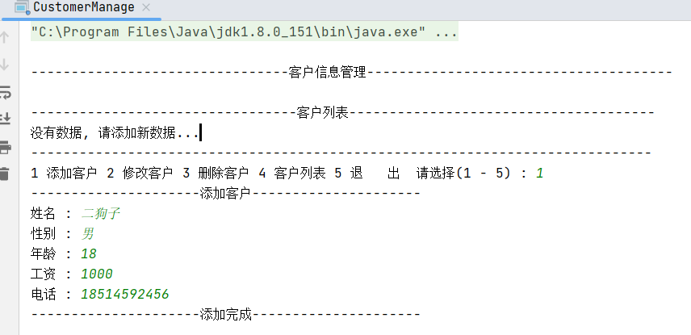

修改客户 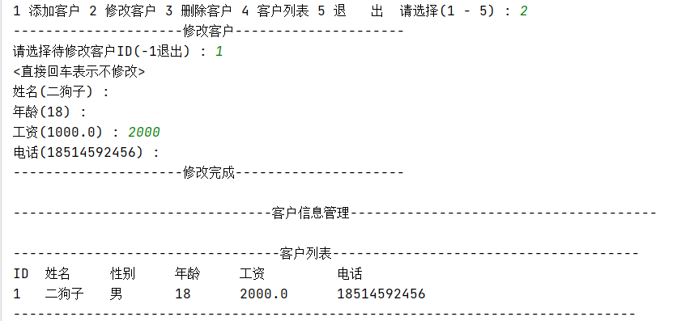

展示客户列表 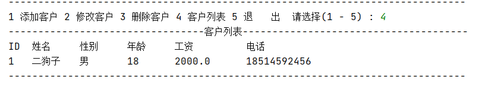

删除客户 

退出系统 

#### 项目导入
1. 打开项目
   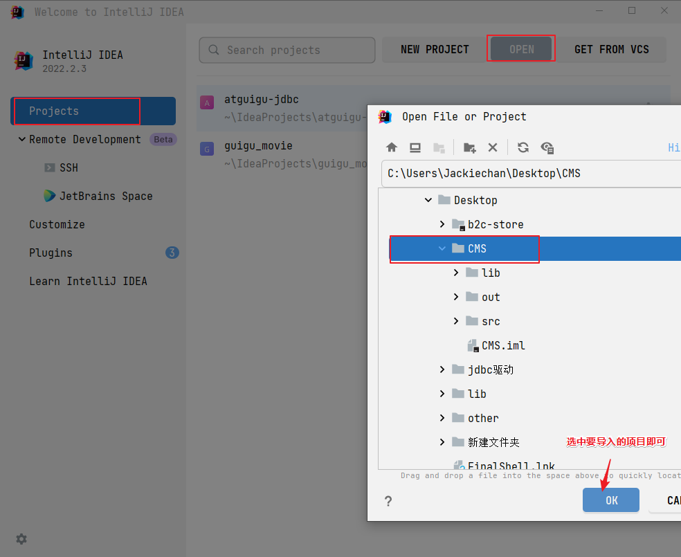
2. 配置jdk
   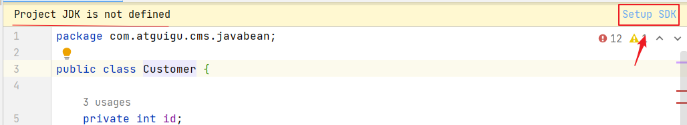
   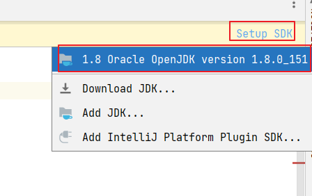

### 7.2基于cms项目添加数据库相关配置

#### 准备数据库脚本
```sql
-- 员工表

CREATE TABLE t_customer(
  id INT PRIMARY KEY AUTO_INCREMENT COMMENT '客户主键',
  NAME VARCHAR(20)  COMMENT '客户名称',
  gender VARCHAR(4) COMMENT '客户性别',
  age INT  COMMENT '客户年龄',
  salary DOUBLE(8,1) COMMENT '客户工资',
  phone VARCHAR(11) COMMENT '客户电话')
```

#### 添加配置文件
> 位置: `src/druid.properties`

```properties
# druid连接池需要的配置参数,key固定命名
driverClassName=com.mysql.cj.jdbc.Driver
username=root
password=root
url=jdbc:mysql:///atguigu
```

#### 导入jdbcv2.0工具类
```java
import com.alibaba.druid.pool.DruidDataSourceFactory;

import javax.sql.DataSource;
import java.sql.Connection;
import java.sql.SQLException;
import java.util.Properties;

/*
这个工具类的作用就是用来给所有的SQL操作提供“连接”，和释放连接。
这里使用ThreadLocal的目的是为了让同一个线程，在多个地方getConnection得到的是同一个连接。
这里使用DataSource的目的是为了（1）限制服务器的连接的上限（2）连接的重用性等
 */
public class JDBCTools {
    private static DataSource ds;
    private static ThreadLocal<Connection> tl = new ThreadLocal<>();
    static{//静态代码块，JDBCToolsVersion1类初始化执行
        try {
            Properties pro = new Properties();
            pro.load(ClassLoader.getSystemResourceAsStream("druid.properties"));
            ds = DruidDataSourceFactory.createDataSource(pro);
        } catch (Exception e) {
            e.printStackTrace();
        }
    }

    public static Connection getConnection() throws SQLException {
         Connection connection = tl.get();
         if(connection  == null){//当前线程还没有拿过连接，就给它从数据库连接池拿一个
             connection = ds.getConnection();
             tl.set(connection);
         }
         return connection;
    }

    public static void free() throws SQLException {
        Connection connection = tl.get();
        if(connection != null){
            tl.remove();
            connection.setAutoCommit(true);//避免还给数据库连接池的连接不是自动提交模式（建议）
            connection.close();
        }
    }
}
```

#### 导入baseDao工具类
```java
public abstract class BaseDao {
    /*
    通用的增、删、改的方法
    String sql：sql
    Object... args：给sql中的?设置的值列表，可以是0~n
     */
    protected int update(String sql,Object... args) throws SQLException {
//        创建PreparedStatement对象，对sql预编译
        Connection connection = JDBCTools.getConnection();
        PreparedStatement ps = connection.prepareStatement(sql);
        //设置?的值
        if(args != null && args.length>0){
            for(int i=0; i<args.length; i++) {
                ps.setObject(i+1, args[i]);//?的编号从1开始，不是从0开始，数组的下标是从0开始
            }
        }

        //执行sql
        int len = ps.executeUpdate();
        ps.close();
        //这里检查下是否开启事务,开启不关闭连接,业务方法关闭!
        //没有开启事务的话,直接回收关闭即可!
        if (connection.getAutoCommit()) {
            //回收
            JDBCTools.free();
        }
        return len;
    }

    /*
    通用的查询多个Javabean对象的方法，例如：多个员工对象，多个部门对象等
    这里的clazz接收的是T类型的Class对象，
    如果查询员工信息，clazz代表Employee.class，
    如果查询部门信息，clazz代表Department.class，
     */
    protected <T> ArrayList<T> query(Class<T> clazz,String sql, Object... args) throws Exception {
        //        创建PreparedStatement对象，对sql预编译
        Connection connection = JDBCTools.getConnection();
        PreparedStatement ps = connection.prepareStatement(sql);
        //设置?的值
        if(args != null && args.length>0){
            for(int i=0; i<args.length; i++) {
                ps.setObject(i+1, args[i]);//?的编号从1开始，不是从0开始，数组的下标是从0开始
            }
        }

        ArrayList<T> list = new ArrayList<>();
        ResultSet res = ps.executeQuery();

        /*
        获取结果集的元数据对象。
        元数据对象中有该结果集一共有几列、列名称是什么等信息
         */
         ResultSetMetaData metaData = res.getMetaData();
        int columnCount = metaData.getColumnCount();//获取结果集列数

        //遍历结果集ResultSet，把查询结果中的一条一条记录，变成一个一个T 对象，放到list中。
        while(res.next()){
            //循环一次代表有一行，代表有一个T对象
            T t = clazz.newInstance();//要求这个类型必须有公共的无参构造

            //把这条记录的每一个单元格的值取出来，设置到t对象对应的属性中。
            for(int i=1; i<=columnCount; i++){
                //for循环一次，代表取某一行的1个单元格的值
                Object value = res.getObject(i);

                //这个值应该是t对象的某个属性值
                //获取该属性对应的Field对象
//                String columnName = metaData.getColumnName(i);//获取第i列的字段名
                String columnName = metaData.getColumnLabel(i);//获取第i列的字段名或字段的别名
                Field field = clazz.getDeclaredField(columnName);
                field.setAccessible(true);//这么做可以操作private的属性

                field.set(t, value);
            }

            list.add(t);
        }

        res.close();
        ps.close();
        //这里检查下是否开启事务,开启不关闭连接,业务方法关闭!
        //没有开启事务的话,直接回收关闭即可!
        if (connection.getAutoCommit()) {
            //回收
            JDBCTools.free();
        }
        return list;
    }

    protected <T> T queryBean(Class<T> clazz,String sql, Object... args) throws Exception {
        ArrayList<T> list = query(clazz, sql, args);
        if(list == null || list.size() == 0){
            return null;
        }
        return list.get(0);
    }
}
```

### 7.3 基于cms项目实战

#### customerService
```java
package com.atguigu.cms.service;

import com.atguigu.cms.dao.CustomerDao;
import com.atguigu.cms.javabean.Customer;

import java.sql.SQLException;
import java.util.ArrayList;
import java.util.List;

/**
 * 这是一个具有管理功能的功能类. 内部数据不允许外部随意修改, 具有更好的封装性.
 */
public class CustomerService {


    private CustomerDao customerDao = new CustomerDao();

    /**
     * 用途：返回所有客户对象
     * 返回：集合
     */
    public List<Customer> getList() {

        try {
            return customerDao.queryList();
        } catch (Exception e) {
            throw new RuntimeException(e);
        }
    }


    /**
     * 用途：添加新客户
     * 参数：customer指定要添加的客户对象
     */
    public void addCustomer(Customer customer)  {
        try {
            customerDao.insertCustomer(customer);
        } catch (SQLException e) {
            throw new RuntimeException(e);
        }
    }

    /**
     * 用途：返回指定id的客户对象记录
     * 参数： id 就是要获取的客户的id号.
     * 返回：封装了客户信息的Customer对象
     */
    public Customer getCustomer(int id) {

        try {
            return customerDao.queryById(id);
        } catch (Exception e) {
            throw new RuntimeException(e);
        }
    }

    /**
     * 修改指定id号的客户对象的信息
     * @param id 客户id
     * @param cust 对象
     * @return 修改成功返回true, false表明指定id的客户未找到
     */
    public boolean modifyCustomer(int id, Customer cust)  {
        int rows = 0;
        try {
            rows = customerDao.updateCustomer(cust);
        } catch (SQLException e) {
            throw new RuntimeException(e);
        }
        return rows > 0;
    }

    /**
     * 用途：删除指定id号的的客户对象记录
     * 参数： id 要删除的客户的id号
     * 返回：删除成功返回true；false表示没有找到
     */
    public boolean removeCustomer(int id) {
        int rows = 0;
        try {
            rows = customerDao.deleteCustomer(id);
        } catch (SQLException e) {
            throw new RuntimeException(e);
        }
        return rows > 0;
    }

}
```

#### customerDao
```java
package com.atguigu.cms.dao;

import com.atguigu.cms.javabean.Customer;
import com.atguigu.cms.utils.BaseDao;

import java.sql.SQLException;
import java.util.ArrayList;
import java.util.List;

/**
 * @Author 赵伟风
 * Description: 客户进行数据库操作的类
 */
public class CustomerDao extends BaseDao {


    public List<Customer> queryList() throws Exception {
        ArrayList<Customer> list = query(Customer.class, "select * from t_customer");
        return list;
    }

    public void insertCustomer(Customer customer) throws SQLException {
       int rows = update("insert into t_customer(name,gender,age,salary,phone) values (?,?,?,?,?)",
                customer.getName(), customer.getGender(),customer.getAge(),customer.getSalary(),customer.getPhone());
    }

    public Customer queryById(int id) throws Exception {
        Customer customer = queryBean(Customer.class, "select * from t_customer where id = ?", id);
        return customer;
    }

    public int deleteCustomer(int id) throws SQLException {
        return update("delete from t_customer where id =?", id);
    }

    public int updateCustomer(Customer cust) throws SQLException {
        return update("update t_customer set name = ? , gender = ? , age = ? ," +
                "salary = ? , phone = ? where id = ? ;", cust.getName(), cust.getGender(),
                cust.getAge(), cust.getSalary(), cust.getPhone(), cust.getId());
    }
}
```
